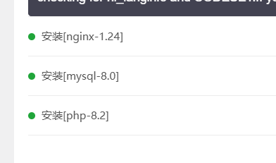
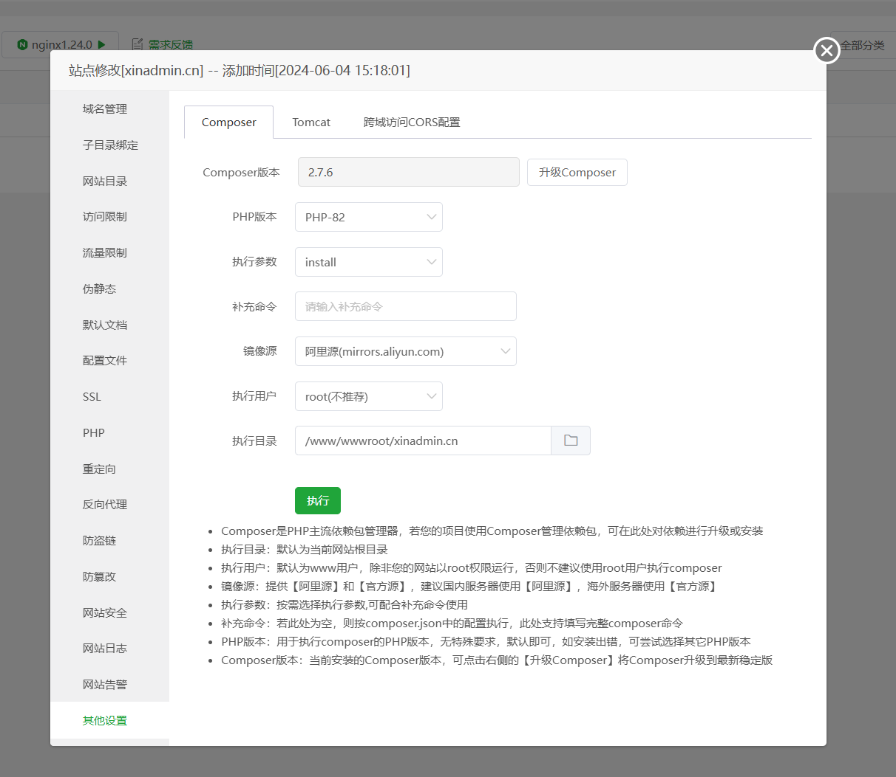
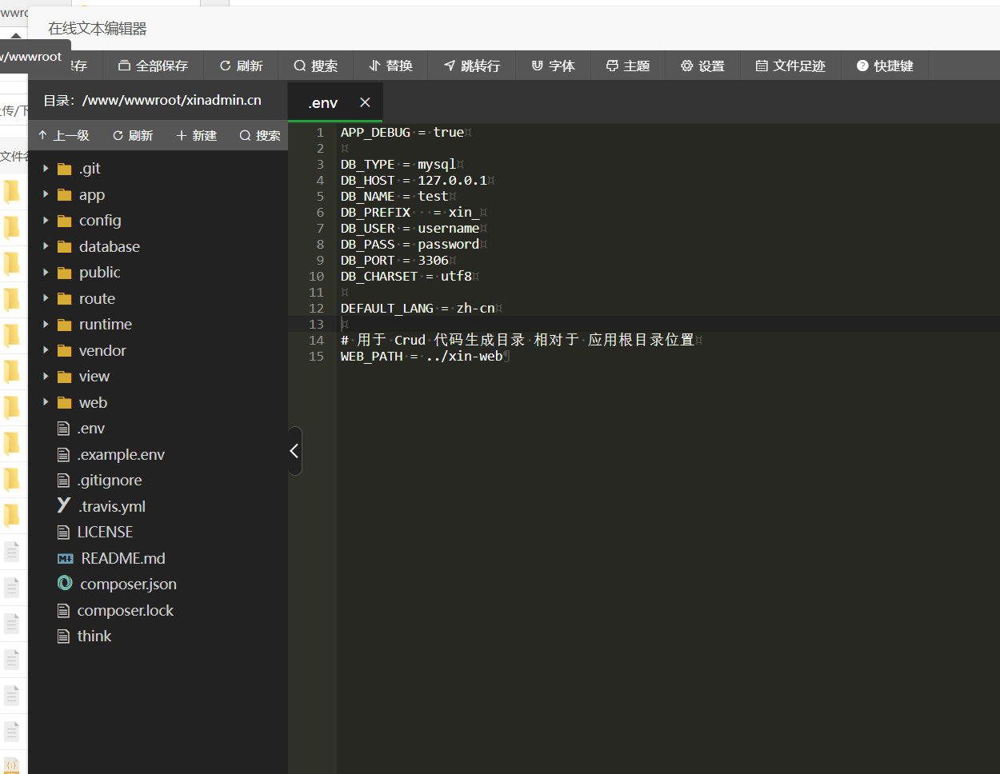

---
group:
  title: 基础
  order: 3
title: 上线与部署
order: 7
---

# 上线与部署

## 宝塔面板部署

我们推荐使用 `Linux` + `宝塔面板` 来进行线上部署，并且使用 git 来进行版本更新，如果你不熟悉宝塔面板的安装，请移步宝塔官网

### 一、添加 web 服务

安装完成宝塔之后，启动宝塔面板，在宝塔面板中安装 web 服务。通常我们需要安装 nginx、mysql 和 php<br>
系统要求的最低版本为 php-8.2、mysql-5.7、nginx-1.24
<ImagePreview float>

</ImagePreview>

### 二、安装 PHP 扩展

进入面板，打开软件商店，选择已安装的 PHP 版本，进入设置。<br>
在安装扩展选项中，安装 `fileinfo` 扩展，安装完成后重启 PHP 和 nginx
<ImagePreview float>

</ImagePreview>

### 三、创建网站

1、进入面板，打开网站管理
<ImagePreview float>

</ImagePreview>

2、新建 PHP 站点，根据提示添加 PHP 站点，并且添加数据库，PHP 版本应大于 8.2

3、测试域名访问，如果你的域名已经解析到当前的宝塔面板地址，访问创建时绑定的域名就可以进入宝塔面板

### 四、拉取代码

1、进入网站目录，打开命令行
<ImagePreview float>

</ImagePreview>

2、通过 git 拉取你的代码，如果你没有安装 `git` 请先安装 `git`

### 五、配置网站与安装依赖

1、配置网站目录，将网站目录设置为 public 目录
<ImagePreview float>

</ImagePreview>

2、配置默认文档，将默认文档中 index.html 放到第一个并保存

3、配置伪静态，将下列代码添加进入伪静态

```text
location / {
  try_files $uri $uri/ /index.html;
}
```

4、配置证书【可忽略】

5、安装依赖，进入 Composer 设置，如果 composer 版本较低，请先升级 composer 版本，升级完成后执行安装，如果安装提示扩展问题请使用 root 重试

### 六、导入数据库与环境变量配置

1、将准备好的数据库文件导入到创建的数据库中
<ImagePreview float>

</ImagePreview>

2、复制根目录中的 .example.env 文件 并重命名为 .env

3、修改数据库名称与密码

### 七、打包前端文件

1、在开发环境 web/admin 目录中执行命令 `npm run build`

2、将打包后的文件放入网站 public 目录中

你也可以将打包后的文件添加到 git，通过 git 来管理项目前端生产文件！

自此，你可以通过绑定的域名访问到当前网站
