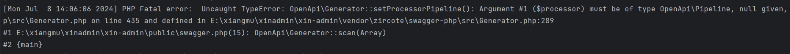
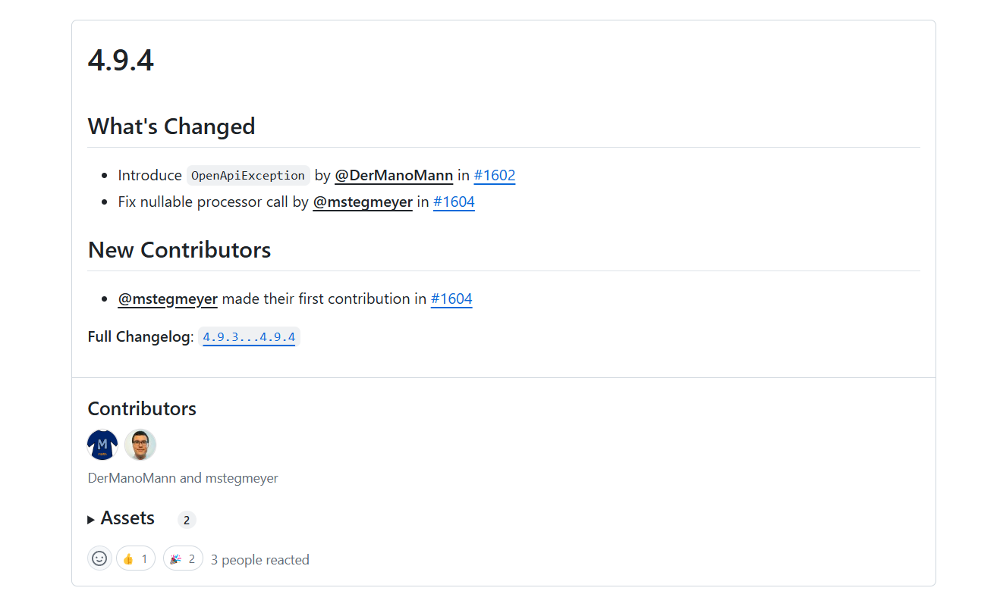
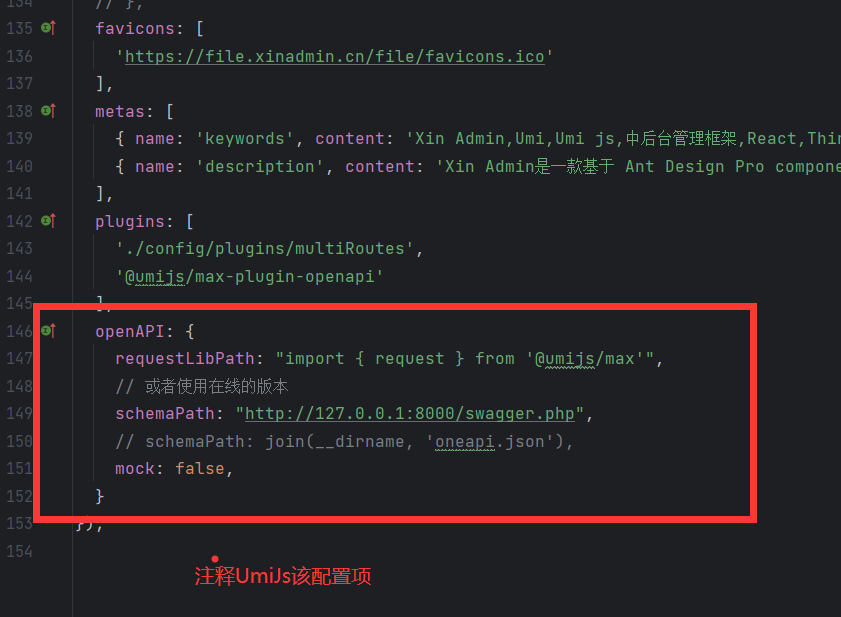

# 常见问题

框架是基于 UmiJs + ThinkPHP 来开发，很多问题在 UmiJs 和 ThinkPHP 文档中就可以找到答案，这里只举例框架相关的比较常见的问题  
如果在项目开发过程中遇到比较复杂的问题，可以加入官方交流群来解答  
如果遇到 Bug 请提交仓库 Issues

## 安装 PHP 依赖报错

- 问题描述：在执行 composer install 时 报错
- 解决方法：
  - 1、更新 composer 版本后重试
  - 2、切换国内镜像 `composer config -g repo.packagist composer https://mirrors.aliyun.com/composer/` 后重试
  - 3、如果是提示找不到某依赖的版本，可能镜像未同步，请切换未官方镜像后重试

## 安装 PNPM 报错

- 问题描述：执行 pnpm install 时报错
- 解决方法：
  - 1、切换阿里云镜像后重新安装 `pnpm config set registry https://registry.npmmirror.com`
  - 2、删除 `node_modules` 文件夹后重新安装依赖

## 启动前端项目报错 `FetchError: request to ../swagger.php failed`

- 问题描述：由于未启动后台项目，获取不到 Api 接口文档
- 解决办法：
  - 1、在 `xin-admin` 目录执行 `php think run` 启动后台项目后重启前端项目即可
  - 2、忽略 配置文件 `config/config.ts` 中的 `openAPI` 配置项

## 打包前端项目后找不到资源文件

- 问题描述：由于 UmiJs 自定义 webpack 打包待完善，对于 PHP 前后端分离项目，部署的时候需要将前端文件放入 public 文件夹中，项目对打包路径做了处理
- 解决办法：
  - 将所有资源文件放到 `assets` 文件夹中与 index.html 平级，index.html 引用 /assets/\*.js 等文件
  - 具体可以参考 Umi Js 的配置，在配置文件 `config/config.ts` 中的 `publicPath`

## PHP 时运行报错

- 问题描述：Fatal error: Uncaught TypeError: OpenApi\Generator::setProcessorPipeline(): Argument #1 ($processor) must be of type OpenApi\Pipeline, null given, called i

该报错在 php swagger 4.9.4 中标记为 fix，之后版本已经修复，composer 镜像应该是没有同步。

- 解决办法：暂时关闭前端对 php swagger 的请求。

