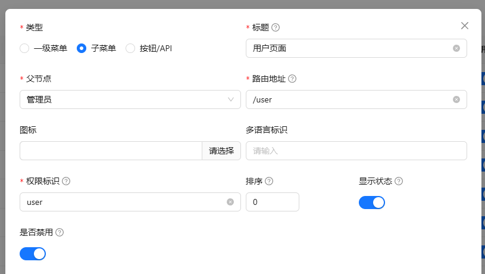

---
group:
  title: 基础教程
  order: 5
title: 菜单权限
order: 2
description: XinAdmin文档 - XinAdmin 实现了非常强大的路由与权限模块。
---

`Laravel` 中默认的授权策略，适用于对应用程序进行更细粒化的控制，比如对模型、资源进行控制，而在前后端分离的模式下，`XinAdmin` 通过 `Laravel Sanctum` 的 `能力` 实现对 `Api` 的访问控制，
当然，`能力` 字段也用于对前端页面中特定操作、视图和页面的访问控制，在此，我们统一将它命名为`权限`。

当你拥有了一条权限，你就可以看到前端页面的 `Button`、`Menu`、`View` 等，通过前端页面的侧边栏菜单，进行访问某个页面，或者在页面中的某个 `Button`，对 `Api` 进行访问。
在后端中，将使用`Laravel Sanctum` 来验证当前用户是否拥有这个能力，进行接口访问控制。

而 `角色` 于储存这些权限，并且决定为用户分配那种权限，只需要更改用户的角色，就可以做到哪些用户，可以访问哪些权限，可以看到哪些页面，可以进行哪些操作。

- 在后台的用户管理中，管理菜单与权限
- 在角色管理中，为角色组分配权限

一切都以可视化的方式进行分配和定义，你只需要在开发的时候使用这些权限就可以。

:::info{title=Tips}

1. 用户仅能看到有权限访问的菜单
2. 用户仅能看到有权限操作的按钮，比如 添加、编辑、删除 按钮都是按权限进行显示的
3. 系统管理员账户可以访问所有已经注册的权限，并且不可修改管理员权限
4. 新增加的页面需要注册权限后才会在菜单中显示
5. 新增加的控制器接口，需要在管理员权限中添加后才可以访问接口
   :::

## 菜单权限

在了解菜单权限之前，首先你要明白什么是菜单，菜单在中后台管理框架中，通常以侧边栏或者顶栏的方式展示，你可以通过点击菜单，来访问应用中的某个页面。

XinAdmin 中的菜单分为两种，`一级菜单`和`子菜单`，子菜单理论支持无限下级，当然在实际应用中超过 五级菜单就会让用户感到疑惑。

当你在`pages`目录下新增一个页面后，你需要在后台的权限管理中去添加这个页面的菜单。


以下是具体配置的解析：

- `标题`：菜单的标题，如果未配置多语言，该项目作为菜单的 label
- `路由地址`：菜单的路由地址，文件系统的文件目录名称
  比如`/pages/User/index.tsx` 文件，对应的路由地址为`/user`
- `父级菜单`：菜单的父级菜单，子菜单必填
- `图标`：菜单的图标，使用 Ant Design 的图标库，自定义参考[图标](/)
- `多语言`：多语言配置，如果未配置多语言，则使用`标题`作为菜单的 label
- `权限标识`：菜单的权限标识
  例: 路由地址 "/index/user" , 权限标识为 "index.user"，不区分大小写
- `排序`：菜单的排序，越小越靠前
- `显示状态`：是否隐藏菜单，隐藏后，菜单将不会在侧边栏中显示，但是用户可以访问到该页面
- `禁用状态`：是否禁用菜单，禁用后，用户将不能访问到该页面，并且用户没有该权限

### 菜单白名单

XinAdmin 默认对所有的页面进行菜单权限验证，但是有时候你希望某个页面所有人都可以访问，那么你就会用到权限验证百名单。

它储存于项目 `web/src/utils` 目录下的 `noPermission.ts` 文件中，通过在数组中配置页面的路由地址，就可以在页面中访问到该页面，并且不用验证页面的权限。

比如 login 页面，不需要验证权限，所以需要在白名单中添加 `/login` 路由地址：

```ts
// web/src/utils/noPermission.ts
/**
 * 路由权限验证白名单
 */
export default ['/login', 'login'];
```

## 按钮 API 权限

按钮权限是针对页面的按钮，比如`添加`、`编辑`、`删除`等按钮，通过配置权限标识，可以控制用户是否可以访问到这些按钮，当然按钮权限也作为后端 API 访问的权限。


以下是具体配置的解析：

- `标题`：按钮的标题
- `权限标识`：按钮的权限标识，与后台的 API 接口权限标识保持一致，不区分大小写，你也可以单独当作按钮或者 API 权限使用
- `排序`：按钮的排序，越小越靠前
- `显示状态`：是否隐藏按钮，隐藏后，按钮将不会在页面中显示，但是用户可以访问到该按钮
- `禁用状态`：是否禁用按钮，禁用后，用户将不能访问到该按钮，并且用户没有该权限

## 权限使用

在实际应用过程中，路由权限通常作为一组接口权限或者按钮权限的前缀，比如我希望拥有一个用户管理页面，并且在页面中拥有新增、编辑、修改、删除四个操作，那么我需要添加的权限有：

- `user`，作为页面的访问权限，拥有这个权限可以访问 `/user` 页面。
- `user.query` 作为查询列表的权限，拥有这个权限可以查询列表数据。
- `user.create` 作为新增的权限，拥有这个权限可以看到新增按钮，并且可以访问后台的新增接口。
- `user.update` 作为编辑的权限，拥有这个权限可以看到编辑按钮，并且可以访问后台的编辑接口。
- `user.delete` 作为删除的权限，拥有这个权限可以看到删除按钮，并且可以访问后台的删除接口。

我们在前端项目目录下新建一个文件：`pages/User/index.tsx`，它的文件系统路由为 `/user`， 页面中有编辑用户信息按钮，用来请求后台新增用户信息：

```tsx | pure
// pages/User/index.tsx
export default () => {
  return (
    <Button type="primary" onClick={() => {}}>
      新增用户信息
    </Button>
  );
};
```

首先我们添加`/user` 页面权限



然后添加按钮权限


将`user.edit`权限添加到按钮上：

```tsx | pure
<ButtonAccess auth={'user.edit'}>
  <Button type="primary" onClick={() => {}}>
    新增用户信息
  </Button>
</ButtonAccess>
```

将 `user.edit` 权限添加到控制器的方法中：

```php
#[RequestMapping('/user', 'user)]
class UserController extends Controller
{
    #[GetMapping(authorize: 'edit')]
    public function edit(): JsonResponse
    {
        return $this->success();
    }
}
```

路由映射的第二个参数就是该路由的权限表示，其中 RequestMapping 的第二个参数，作为当前控制器的权限前缀。

如果要访问 edit 方法，需要拥有 `user.edit` 权限。

### XinTable

在前端 XinTable 组件中，你也需要为组件定义权限前缀，组件自动为`新增按钮`、`编辑按钮`、`删除按钮` 添加权限，对应的是 `前缀` + `create`、`update`、`delete`

```tsx | pure
<XinTable accessName={'user'} columns={[]} rowKey={'user_id'} />
```

更多关于 XinTable 的配置和说明请参考[XinTable](/laravel/frontend-table)

## 验证流程

1. 用户访问 login 页面，使用账户密码登录，获取 Token，系统为该 Token 赋予权限【能力】。
2. 用户通过权限【能力】，获取菜单，并且在前端页面中加载这些菜单。
3. 用户点击菜单访问某个页面路由，如果没有该页面的权限【能力】将显示 403 页面。
4. 页面中根据拥有的权限，展示相应的操作，如新增、编辑、删除等。
5. 用户点击新增按钮输入表单数据提交，后台接收到请求后，验证 Token 是否拥有该接口的权限【能力】。
6. 如果验证通过返回相应的结果，如果验证失败返回无权限提示。
