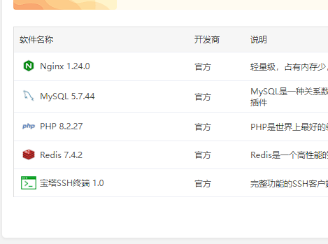
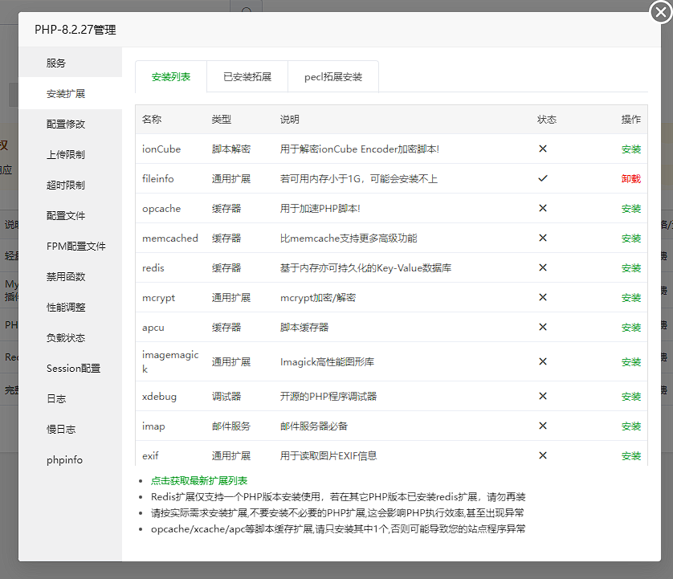
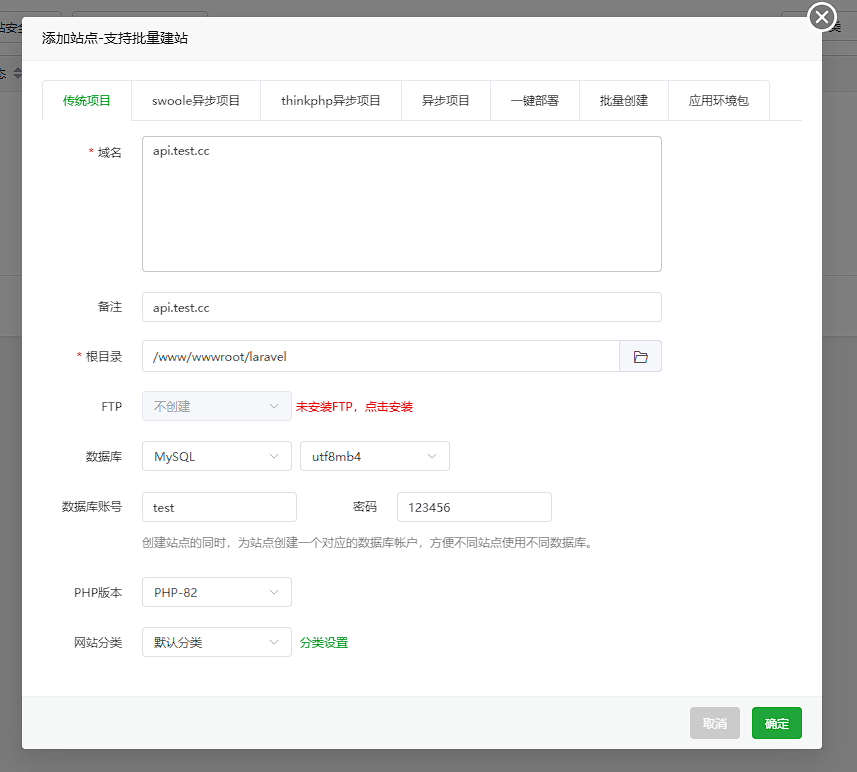
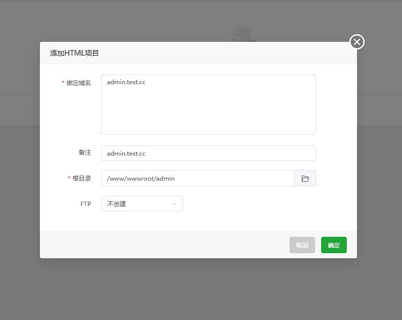

当您准备好将 `XinAdmin` 应用程序部署到`生产环境`时，您可以采取一些重要措施来确保您的应用程序尽可能高效地运行。
在本文档中，我们将介绍一些很好的起点，以确保您的 `XinAdmin` 应用程序得到正确部署。
生产环境中建议使用稳定性强、便于部署的[宝塔面板](https://www.bt.cn/)，这样可以为你省去一大堆配置问题，也可以避免不必要的异常。
本章中默认使用宝塔作为生产环境，如果你不知道宝塔面板怎么安装，请移步[宝塔官网](https://www.bt.cn/)。

:::info
在前后端分离开发的模式下，我们建议你保持本地环境作为开发环境，并通过 `php artisan serve` 和 `pnpm run dev` 来启动本地项目作为开发环境，本章节主要讲解程序开发完成后部署事项。
:::

## 环境要求

为了使 XinAdmin 应用正常运行，请确保你的服务器安装了以下应用与扩展：

- Nginx
- Redis
- Mysql >= 5.7
- PHP >= 8.2
- PHP 扩展：Ctype PHP、 cURL PHP 扩展 、DOM PHP 扩展 、Fileinfo PHP 扩展 、Filter PHP 扩展 、Hash PHP 扩展 、Mbstring PHP 扩展 、OpenSSL PHP 扩展 、PCRE PHP 扩展 、PDO PHP 扩展 、Session PHP 扩展 、Tokenizer PHP 扩展 、XML PHP 扩展
- 如果需要使用 Swoole 来启动服务，还需要安装 Swoole 扩展。

<div style="margin: 20px 0">
  
  
</div>
以宝塔为例，你可以在宝塔面板的应用商店中安装这些应用，安装完成 PHP 之后，在 PHP 的设置中安装所需要的扩展。

当然你也可以根据自己的需求来搭建自己的的生产环境，对于新手而言，宝塔面板更简单快捷。

## 分离式部署

在生产环境中，如果你希望 XinAdmin 应用程序分别搭建在两个服务器中，你可以使用 Nginx 来分别代理 前端和后端应用，或者使用不同的服务器来运行它们。

我们也推荐你这样做，因为这样部署不会影响部署后的代码结构，更有利于静态资源的维护。

### 站点创建

在分离式部署的情况下，你需要创建两个站点，一个用来存放`PHP代码`作为`API服务`，一个用来存放前端打包后的`静态资源`。

如果你熟悉 `Nginx` 的配置，你可以自己来配置 `Nginx` 站点，下面是用宝塔来创建两个不同的站点。

<div style="margin: 20px 0">
  
  
</div>

- 实际应用中，你需要将你的域名解析到当前服务器的 IP 地址中。如图例，它会为你自动创建 `Nginx` 站点，并且创建一个空数据库。

- 请确保你准备了你项目的`目录`、`数据库`、`域名`等基础操作。

- 你也可以使用`FTP`或者`Git`来管理你的代码。

- 你需要将你的后端代码和前端代码分别部署到不同的服务器中。

### 后端部署

1. 通过 Git 来将你的后端代码上传到服务器中。
2. 如果你使用 Git，它可能已经忽略了依赖文件目录`vendor`，你需要使用`composer`安装依赖。
3. 配置`.env` 环境变量中的数据库信息以及其它相关配置。
4. 执行 `php artisan migrate` 来迁移数据库，或者直接导入 `SQL` 文件。
5. 执行 `php artisan db:seed` 来填充数据库默认数据，或者直接导入 `SQL` 文件。
6. 执行 `php artisan key:generate --ansi` 来生成你`APP`的唯一密钥。
7. 执行 `php artisan storage:link` 来创建文件储存器链接。

### 前端部署

1. 修改前端项目目录中的`.env` 文件，将`DOMAIN` 修改为你后端绑定的域名。
2. 在本地前端项目目录中执行 `pnpm run build` 来打包前端依赖。
3. 打包后的静态资源会存放在 `dist` 目录中，请将`dist`目录中的文件上传到服务器的前端项目目录中。

### Nginx 配置

`XinAdmin` 的后端应用中，你还要确保站点配置中包含以下的配置，你的 `Web` 站点 的所有请求都会由 `Laravel` 应用程序来处理，站点默认支持跨域请求。

```nginx
location / {
    try_files $uri $uri/ /index.php?$query_string;
}
```

`XinAdmin` 的前端应用中，由于 `React` 是大型的单页面应用，你需要确保站点配置中包含以下的配置，所有的路由统一进入 `index.html` 文件。

```nginx
location / {
  try_files $uri $uri/ /index.html;
}
```

## 单站点部署

`XinAdmin` 也支持将项目部署在`单站点`之下，你可以通过以下步骤来将你的`XinAdmin`应用程序部署到一个站点的目录之下。

与分离式部署一样，你需要创建一个站点并且新建一个空数据库。


通过以下步骤将 XinAdmin 后端程序部署到站点中：

1. 通过 Git 来将你的后端代码上传到服务器中。
2. 如果你使用 Git，它可能已经忽略了依赖文件目录`vendor`，你需要使用`composer`安装依赖。
3. 配置`.env` 环境变量中的数据库信息以及其它相关配置。
4. 执行 `php artisan migrate` 来迁移数据库，或者直接导入 `SQL` 文件。
5. 执行 `php artisan db:seed` 来填充数据库默认数据，或者直接导入 `SQL` 文件。
6. 执行 `php artisan key:generate --ansi` 来生成你`APP`的唯一密钥。
7. 执行 `php artisan storage:link` 来创建文件储存器链接。

### 打包前端项目

在单站点部署的情况下，为了使前端资源不污染后端项目资源，你需要修改 UmiJs 的打包配置，来将前端应用的静态资源文件放置在`assets`目录中。

1. 请在前端项目目录中的`.umirc.ts` 文件中修改以下配置：

   ```js
   // 前端项目目录 .umirc.ts 文件

   export default defineConfig({
     // 如果前端文件放在后端 public 下面可开启
     publicPath: '/assets/',
   });
   ```

2. 修改前端项目目录中的`.env` 文件，将`DOMAIN` 修改为`/index.php` 。

   ```markdown
   # DOMAIN 请求地址，在开发环境中使用本地服务器地址，在线上部署时：

   # 如果将前端文件与后端放在同一域名下，请使用 /index.php

   # 如果前端文件与后端分别放在两个域名之下，请使用服务器地址

   DOMAIN='/index.php'
   ```

3. 在本地前端项目目录中执行 `pnpm run build` 来打包前端依赖。
4. 在打包后的静态资源中，你需要将`dist`目录中的文件上传到站点的`public\assets`目录中，如果不存在这个目录请新建。
5. 将`index.html`文件单独移出到 `public` 目录中。

### Nginx 配置

你还需要在你的站点的配置文件中，将`index.html`设置为默认文件,并添加以下配置：

```nginx
index index.html index.htm default.htm default.html;

location / {
  try_files $uri $uri/ /index.html;
}
```

这样你的应用就可以通过绑定的域名正常访问了。

站点的 UI 会默认代理到`index.html`文件。

所有的 API 请求都会通过`index.php`文件传输给后端 Laravel 应用。

## 配置优化

将应用程序部署到生产环境时，应缓存各种文件，包括配置、事件、路由和视图。

Laravel 提供了一个方便的 Artisan 命令，可以缓存所有这些文件。

此命令通常应在应用程序的部署过程中调用：optimize

```shell
php artisan optimize
```

具体命令内容可以参考 [Laravel 部署](https://laravel.com/docs/12.x/deployment#optimization) 章节。

:::info
如果你的服务器配置不错，`Umi` 也支持 SSR（服务器渲染）以提供更快的访问速度，具体参考 `UmiJs` 文档。
:::

### 使用 Swoole

如果你希望你的项目使用 Swoole 来处理请求，你可以参考 [Swoole 服务](/laravel/base-swoole#swoole-serve)。
