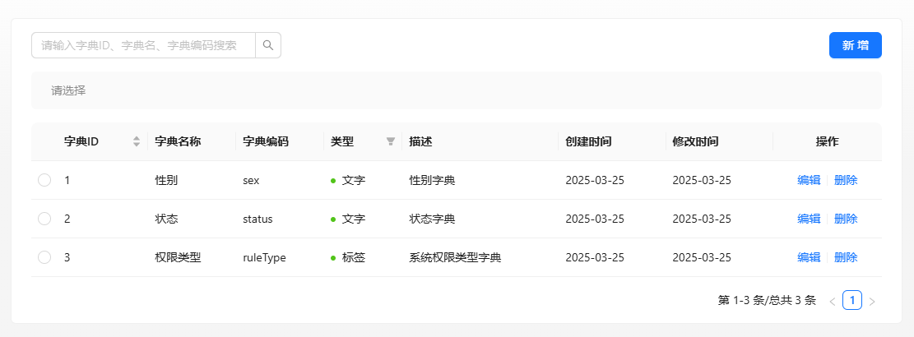
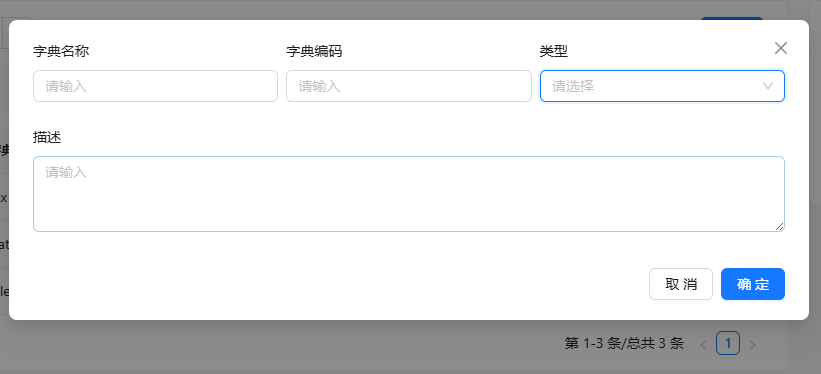
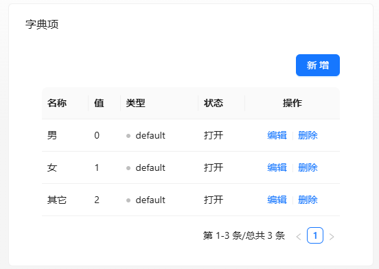

XinAdmin 提供了强大的系统字典功能，数据字典是将单选或者多选的选项作为配置，不必写死在前端编码中，比如：`商品类型字典`中有字典项：`食品`、`药物`、`衣物`、`化妆品`等，你就可以用字典来进行动态的配置，以便后期修改和维护。

字典适用于对业务中不确定的多选项进行可配置的方案，减少业务代码的维护。
在 XinAdmin 中，数据字典的配置在 `系统管理 -> 字典管理` 中，你可以配置你所需要的字典，并且在前端代码中使用字典组件进行展示，我们也建议你在开发过程中使用字典进行数据展示，它的优势有：

- 统一管理：集中管理系统中的各种固定数据，如性别、状态、类型等
- 维护方便：通过界面即可完成字典项的增删改查
- 使用简单：配置好即可使用，通过 json 配置字典 key
- 提高效率：提高开发效率，避免硬编码

## 新增字典

字典分为`字典`与`字典项`, 在菜单的 `系统管理 -> 字典管理` 中你可以新增或者修改字典。



其中`字典编码`作为该字典的唯一标识，你在使用该字典的时候需要用到该编码，字典的类型分为：`文字`、`徽标`与`标签`，类型是在表格中的展示类型，
分别对应`antd`中的`Text`、`Badge`和`Tag`，你可以根据你的业务需要来选择以那种形态展示。



字典项，作为字典的子集，你可以为该字典配置有哪些可选的参数，并且将对应的数据值存入数据库中，方便后期使用，比如性别字典有`男`、`女`、`其它`选项。



字典项的类型作为其展示的状态，可以通过设置 `success`、 `processing`、 `error`、 `default`、 `warning` 来代表不同的状态。

:::warning{title="注意"}
字典项的类型只有在字典类型为`标签`和`徽标`时才有效，其他类型无效。
:::

## 使用字典

字典的使用分为`数据输入`和`数据展示`两种，XinAdmin 结合`antd`的 json 表单，可以直接来使用`字典`作为表单多选或者单选的`item`。

```tsx | pure
import { useModel } from '@umijs/max';

export default () => {
  const { dictEnum } = useModel('dictModel');

  const columns = [
    {
      title: '性别',
      dataIndex: 'sex',
      valueType: 'radio', // 表单的展示类型
      filters: true,
      hideInSearch: true,
      valueEnum: dictEnum.get('sex'), // 表单的数据字典，使用antd 的 valueEnum
      render: (_, date) => <XinDict value={date.sex} dict={'sex'} />, // 使用 render 来指定表格渲染字典
    },
  ];
};
```

- `dictEnum` 是字典的枚举，你可以在字典管理中查看到字典的枚举，字典的枚举是字典的`字典编码`，你可以通过`dictEnum.get('字典编码')`来获取字典的枚举，然后使用`XinDict`组件来展示字典。
- `XinDict` 组件接受两个参数，第一个参数是字典的值，第二个参数是字典的`字典编码`，你可以在表格中通过`render`来指定字典的展示。

你可以使用`valueType` 来指定表单的展示类型，只要支持 `valueEnum` 的表单类型都可以使用字典 `dictEnum`，你可以查看[Ant Design ProComponents 的 valueEnum](https://procomponents.ant.design/components/schema#valueenum)
来使用 `valueType` 来指定字典在表单中的展示。
