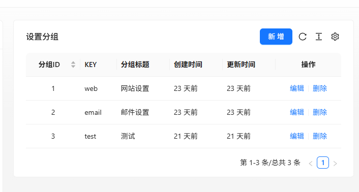
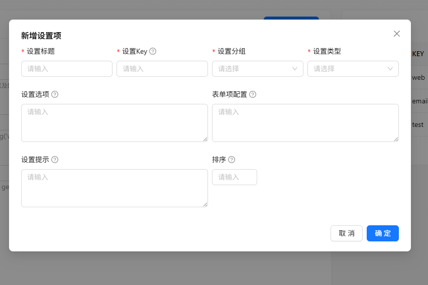
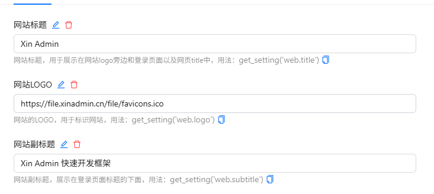

XinAdmin 提供的强大且方便的系统设置，帮助开发者实现对业务中可变参数的配置。比如：
在对网站邮箱的配置中，传统操作是将邮箱的配置写入到 `.env` 文件中，
这样虽然可以实现我们的需求，但是在我们需要修改这些配置的时候，往往需要修改代码文件，如果你使用的是`swoole` 可能还需要每次重启服务。
面对这样的问题，我们通过`mysql` + `redis` 的方式，为开发者提供高可用的系统配置，不仅可以通过后台来管理配置参数，而且通过 `redis` 缓存提供高性能的配置读取。

目前已经支持输入框、文本域、数字输入框、单选框、多选框、开关等，后续会陆续添加对其它表单组件的支持。

## 添加设置

在管理后台中，点击 `系统管理` -> `系统设置`，即可看到系统设置页面。

### 设置分组

通过添加设置分组，可以将不同的设置进行分类。



其中设置分组的 `key` 作为获取设置的前缀，在设置组中必须唯一存在。

### 设置项

通过添加设置项，可以配置不同的设置项。



### 设置项描述

| 字段       | 说明                                                                                                                    | 必填 |
| ---------- | ----------------------------------------------------------------------------------------------------------------------- | ---- |
| 设置标题   | 设置的标题，用于在页面上显示                                                                                            | 是   |
| 设置 Key   | 设置的唯一标识，用于在代码中获取设置值，在当前设置组中必须唯一                                                          | 是   |
| 设置分组   | 设置的分组                                                                                                              | 是   |
| 设置类型   | 设置类型，用于选择设置项的输入类型，                                                                                    | 是   |
| 设置选项   | 当设置类型为单选框、多选、选择器的时候需要填入设置选项，label=key 格式，以换行分割                                      | 否   |
| 表单项配置 | 表单项的配置，支持 Ant Design 所有非表达式的值，无需引号，比如：placeholder=Error 或 visibilityToggle=false, 以换行分割 | 否   |
| 默认值     | 默认的值                                                                                                                | 否   |
| 设置提示   | 设置下方的提示信息                                                                                                      | 否   |
| 排序       | 设置的排序，数字越大越靠前                                                                                              | 否   |

## 设置用法



在添加完成设置后，选择你所添加的分组，你就可以看到该设置项，在代码中可以通过 `setting` 助手函数来获取设置的值。

```php

$logo = setting('web.logo');

echo $logo;

// 输出： https://file.xinadmin.cn/file/favicons.ico

```

当然，你也可以通过传入设置的分组`key`获取该组的所有配置：

```php
$web = setting('web');

echo $web['logo'];

// 输出： https://file.xinadmin.cn/file/favicons.ico
```

此时 `$web` 为包含 `web` 分组所有设置的数组。
