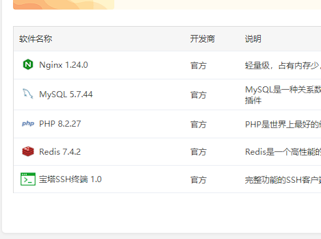
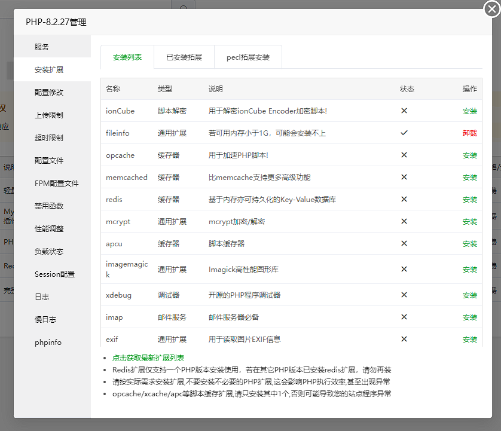
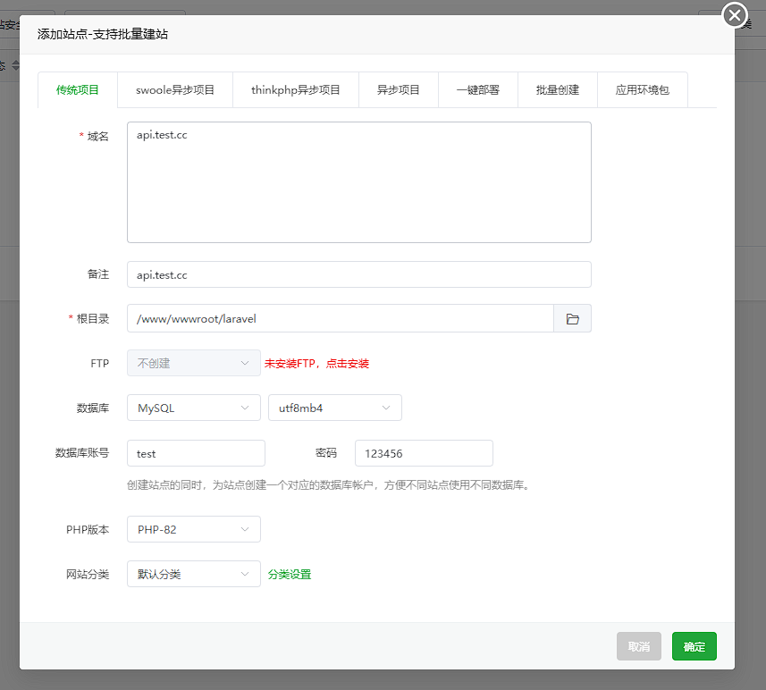

当您准备好将 XinAdmin 应用程序部署到生产环境时，您可以采取一些重要措施来确保您的应用程序尽可能高效地运行。
在本文档中，我们将介绍一些很好的起点，以确保您的 XinAdmin 应用程序得到正确部署。
在前后端分离开发的模式下，我们建议你保持本地环境作为开发环境。
生产环境中建议使用稳定性强、便于部署的宝塔面板，这样可以为你省去一大堆配置问题，也可以避免不必要的异常。
本章中默认使用宝塔作为生产环境，如果你不知道宝塔面板怎么安装，请移步宝塔官网。

## 环境要求

<ImagePreview float>
  
</ImagePreview>
<ImagePreview float>
  
</ImagePreview>

为了使 XinAdmin 应用正常运行，请确保你的服务器安装了以下应用与扩展：

- Nginx
- Redis
- Mysql >= 5.7
- PHP >= 8.2
- Ctype PHP 扩展
- cURL PHP 扩展
- DOM PHP 扩展
- Fileinfo PHP 扩展
- Filter PHP 扩展
- Hash PHP 扩展
- Mbstring PHP 扩展
- OpenSSL PHP 扩展
- PCRE PHP 扩展
- PDO PHP 扩展
- Session PHP 扩展
- Tokenizer PHP 扩展
- XML PHP 扩展

以宝塔为例，你可以在宝塔面板的应用商店中安装这些应用，安装完成 PHP 之后，在 PHP 的设置中安装所需要的扩展。
当然你也可以根据自己的需求来搭建自己的的生产环境，对于新手而言，宝塔面板更简单快捷。

## 站点创建

<ImagePreview float>
  
  
</ImagePreview>
如果你熟悉 Nginx 的配置，你可以自己来配置 Nginx 站点，在前后端分离的模式下，我们建议你将服务部署到不同的站点之下，以便于管理。你也可以使用 Nginx 来自定义你的站点。

- 实际应用中，你需要将你的域名解析到当前服务器的 IP 地址中。如图例，它会为你自动创建 Nginx 站点，并且创建一个空数据库。
- 请确保你准备了你项目的目录、数据库、域名等基础操作。

### 后端配置

XinAdmin 的后端应用中，你还要确保站点配置中包含以下的配置，你的 Web 站点 的所有请求都会由 Laravel 应用程序来处理。
宝塔站点的创建已经为你配置好了一些，你可以在宝塔站点设置的配置文件中设置。

你需要将你的代码放置到站点目录中，并将网站的运行目录修改为 `站点目录地址/public`，推荐使用 Git 来管理代码。

```nginx
server {
    add_header X-Frame-Options "SAMEORIGIN";
    add_header X-Content-Type-Options "nosniff";

    charset utf-8;

    # 伪静态配置
    location / {
        try_files $uri $uri/ /index.php?$query_string;
    }

    location = /favicon.ico { access_log off; log_not_found off; }
    location = /robots.txt  { access_log off; log_not_found off; }

    error_page 404 /index.php;

    location ~ ^/index\.php(/|$) {
        fastcgi_pass unix:/var/run/php/php8.2-fpm.sock;
        fastcgi_param SCRIPT_FILENAME $realpath_root$fastcgi_script_name;
        include fastcgi_params;
        fastcgi_hide_header X-Powered-By;
    }

    location ~ /\.(?!well-known).* {
        deny all;
    }
}
```

### 前端配置

独立部署 Web 项目，请于 /web 目录 手动执行 pnpm build，将 dist 文件夹的内容部署到前端项目站点即可，站点默认支持跨域请求。

你还需要以下伪静态配置来确保你的前端站点可以正常访问

```nginx
location / {
  try_files $uri $uri/ /index.html;
}
```

:::info
如果你的服务器配置不错，Umi 也支持 SSR（服务器渲染）以提供更快的访问速度，具体参考 UmiJs 文档。
:::

## 配置优化

将应用程序部署到生产环境时，应缓存各种文件，包括配置、事件、路由和视图。Laravel 提供了一个方便的 Artisan 命令，可以缓存所有这些文件。此命令通常应在应用程序的部署过程中调用：optimize

```shell
php artisan optimize
```
