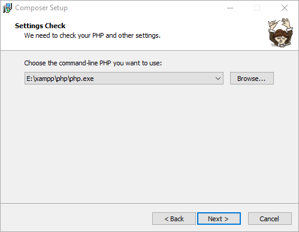
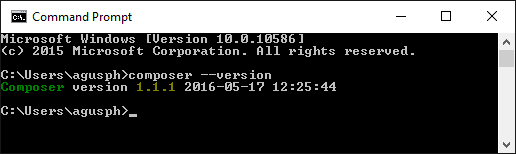

:::info
如果你使用的是 EServer 或者宝塔面板，可以不用手动安装 Composer，国内的朋友记得切换镜像源或者执行 `composer selfupdate` 更新 Composer 哦！
:::

## 前言

Composer 是 PHP 的一个依赖管理工具。我们可以在项目中声明所依赖的外部工具库，Composer 会帮你安装这些依赖的库文件，有了它，我们就可以很轻松的使用一个命令将其他人的优秀代码引用到我们的项目中来。

Composer 默认情况下不是全局安装，而是基于指定的项目的某个目录中（例如 vendor）进行安装。

Composer 需要 PHP 5.3.2+ 以上版本，且需要开启 openssl。

Composer 可运行在 Windows 、 Linux 以及 OSX 平台上。

## Windows 平台

Windows 平台上，我们只需要下载 Composer-Setup.exe 后，一步步安装即可。

需要注意的是你需要开启 openssl 配置，我们打开 php 目录下的 php.ini，将 extension=php_openssl.dll 前面的分号去掉就可以了。



安装成功后，我们可以通过命令窗口(cmd) 输入 composer --version 命令来查看是否安装成功：



接下来我们可以更改 Composer 镜像：

```shell
composer config -g repo.packagist composer https://mirrors.aliyun.com/composer/
# 镜像地址
# composer        https://packagist.org  官方镜像
# phpcomposer     https://packagist.phpcomposer.com 中文镜像
# aliyun          https://mirrors.aliyun.com/composer 阿里云镜像
# tencent         https://mirrors.cloud.tencent.com/composer 腾讯云镜像
# huawei          https://mirrors.huaweicloud.com/repository/php 华为云镜像
# 其它镜像
# laravel-china   https://packagist.laravel-china.org
# cnpkg           https://php.cnpkg.org cnpkg
# sjtug           https://packagist.mirrors.sjtug.sjtu.edu.cn
```

取消配置：

```shell
composer config -g --unset repos.packagist
```

## Linux 平台

Linux 平台可以使用以下命令来安装：

```shell
# php -r "copy('https://install.phpcomposer.com/installer', 'composer-setup.php');"
# php composer-setup.php

All settings correct for using Composer
Downloading...

Composer (version 1.6.5) successfully installed to: /root/composer.phar
Use it: php composer.phar
```

移动 composer.phar，这样 composer 就可以进行全局调用：

```shell
mv composer.phar /usr/local/bin/composer
```

切换为国内镜像：

```shell
composer config -g repo.packagist composer https://mirrors.aliyun.com/composer/
```

更新 composer：

```shell
composer selfupdate
```

## Mac OS 系统

Mac OS 系统可以使用以下命令来安装：

```shell
$ curl -sS https://getcomposer.org/installer | php
$ sudo mv composer.phar /usr/local/bin/composer
$ composer --version
Composer version 1.7.2 2018-08-16 16:57:12
```

切换为国内镜像：

```shell
composer config -g repo.packagist composer https://mirrors.aliyun.com/composer/
```

更新 composer：

```shell
composer selfupdate
```

## 遇到问题？

1. 建议先将 Composer 版本升级到最新：

```shell
composer self-update
```

2. 执行诊断命令：

```shell
composer diagnose
```

3. 清除缓存：

```shell
composer clear
```

4. 若项目之前已通过其他源安装，则需要更新 composer.lock 文件，执行命令：

```shell
composer update --lock
```

5. 重试一次
