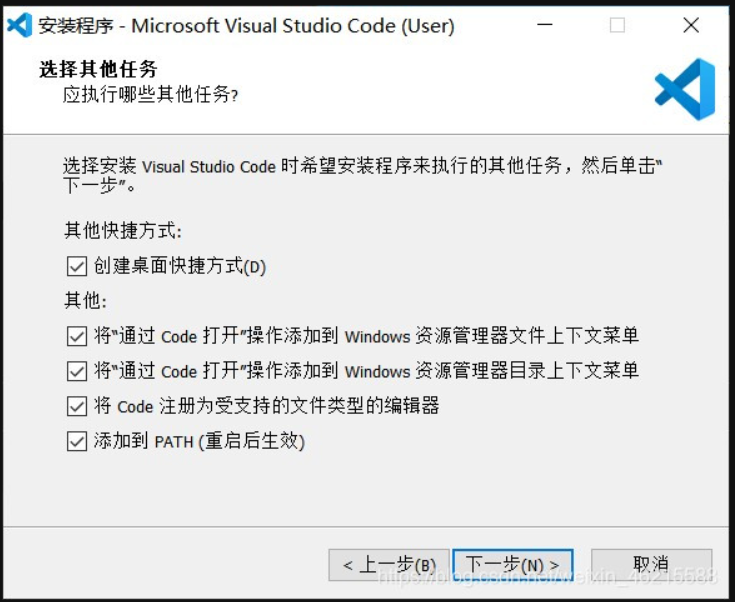

## 前言

Visual Studio Code（以下简称 VS Code）是微软公司开发的、面向广大程序员的强大的跨平台源代码编辑器。说白了本质上就是一种看起来很 NB 高级的 Notepad。它允许用户以插件的形式，来 DIY 自己的开发环境，基本上覆盖了所有的开发语言。XinAdmin 的开发也是使用 VS Code，在本章中我们通过介绍对 VS Code 的使用来搭建 XinAdmin 的开发环境。

## 下载与安装

官方下载地址：[官方网站](https://code.visualstudio.com/)

下载后打开,同意协议后直接安装

