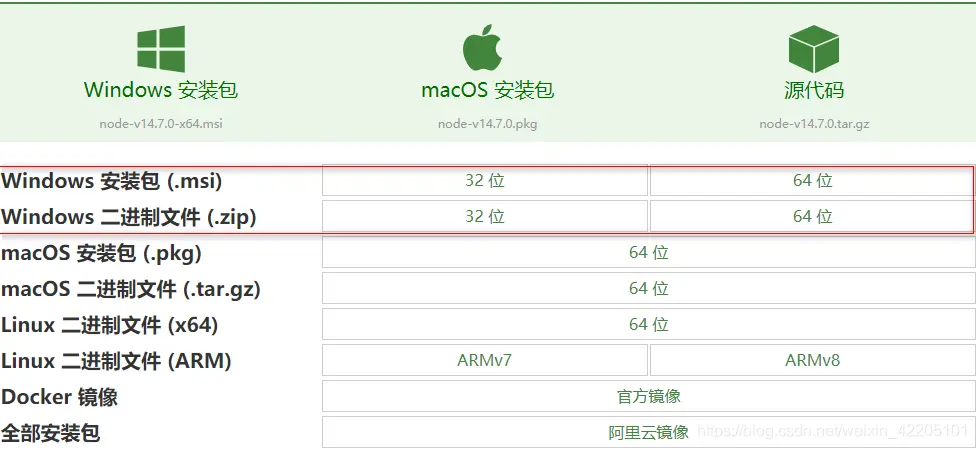
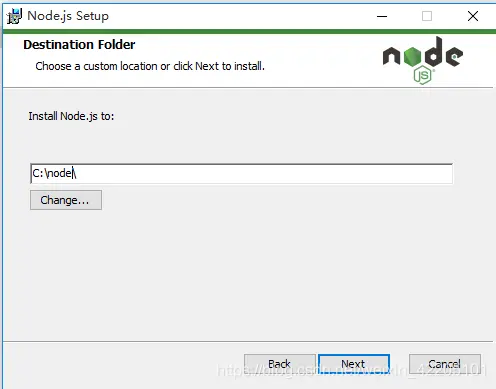
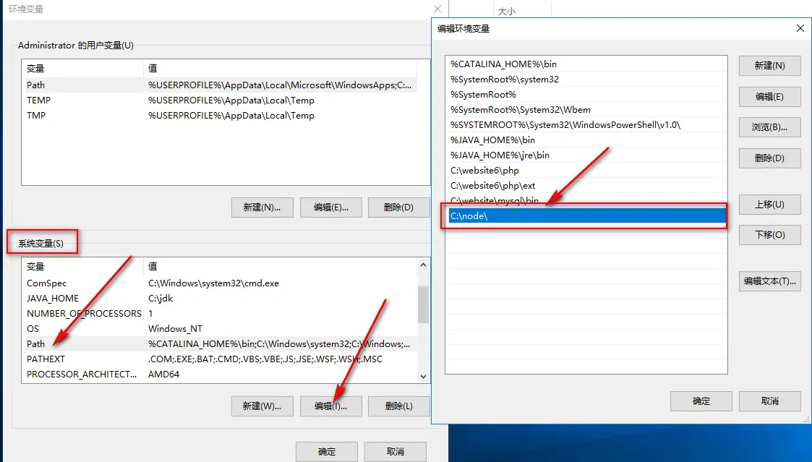
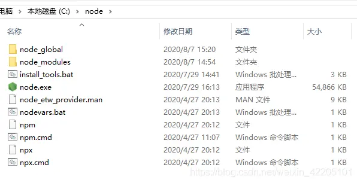
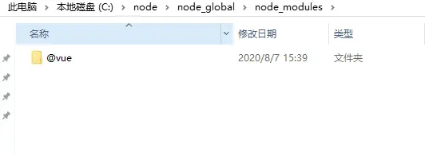
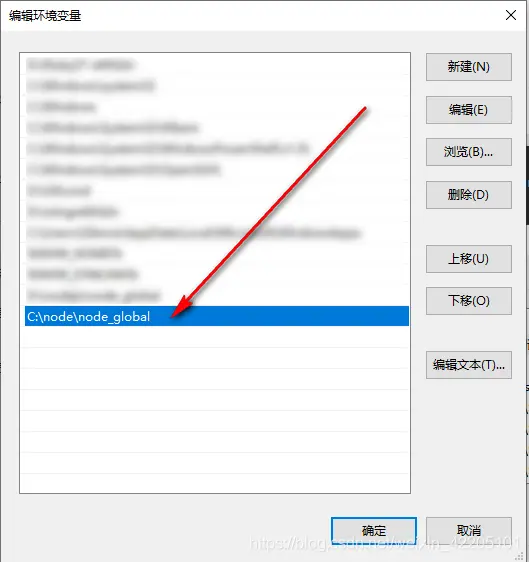

## 前言

Node.js 是一个免费、开源、跨平台的 JavaScript 运行时环境， 允许开发人员在浏览器之外编写命令行工具和服务器端脚本，npm 是 Node.js 的标准包管理器，它最初是一种下载和管理 Node.js 包依赖的方法，但后来也成为前端 JavaScript 中使用的工具。

:::info
使用 nvm 来管理 node js 更方便，如果你使用 nvm 可以忽略 node js 与 nvm 的安装
:::

```php
# 本章节选改自简书：【Nodejs安装及环境配置】
# 作者: 【月半小夜曲_】
# 链接地址: https://www.jianshu.com/p/13f45e24b1de
```

## 1、下载安装

[点击这里下载](https://nodejs.org/zh-cn/download/)

根据自己电脑系统及位数选择，我这里选择 windows64 位.msi 格式安装包

.msi 和.zip 格式区别：

- .msi 是 Windows installer 开发出来的程序安装文件，它可以让你安装，修改，卸载你所安装的程序。说白了.msi 就是 Windows installer 的数据包，把所有和安装文件相关的内容封装在一个包里。
- .zip 是一个压缩包，解压之后即可，不需要安装



下载完成后，双击安装包，开始安装，一直点 next 即可，安装路径默认在 C:\Program Files 下，也可以自定义修改



- npm package manager 表示 npm 包管理器

- online documentation shortcuts 在线文档快捷方式

- Add to PATH 添加 node 安装路径到环境变量

安装完成后，.msi 格式的安装包已经将 node.exe 添加到系统环境变量 path 中,如果你下载的是.zip 格式，因为没有安装过程，所以需要手动将 node.exe 所在目录添加到环境变量 path 中，查看系统变量验证



既然已经将 node 添加到全局系统变量，我们可以直接在 CMD 窗口中任意位置执行 node，打开 CMD 窗口，执行命令 node -v 查看 node 版本， 最新版的 node 在安装时同时也安装了 npm,执行 npm -v 查看 npm 版本

```shell
node -v
# 输出版本。例： v14.7.0

npm -v
# 输出版本。例：6.14.7
```

## 2、修改全局依赖包下载路径

默认情况下，我们在执行 npm install -g XXXX 下载全局包时，这个包的默认存放路径位 C:\Users\用户名\AppData\Roaming\npm\node_modules 下，可以通过 CMD 指令 npm root -g 查看

```shell
C:\Users\liaijie\AppData\Roaming\npm\node_modules
```

但是有时候我们不想让全局包放在这里，我们可以自定义存放目录,在 CMD 窗口执行以下两条命令修改默认路径：

```shell
npm config set prefix "C:\node\node_global"

npm config set cache "C:\node\node_cache"
```

或者打开 c:\node\node_modules\npm\.npmrc 文件，修改如下：

prefix =C:\node\node_global
cache = C:\node\node_cache

以上操作表示，修改全局包下载目录为 C:\node\node_global,缓存目录为 C:\node\node_cache,并会自动创建 node_global 目录，而 node_cache 目录是缓存目录，会在你下载全局包时自动创建



## 3、配置环境变量

因为我们修改了全局包的下载路径，那么自然而然，我们下载的全局包就会存放在 c:\node\node_global\node_modules，而其对应的 cmd 指令会存放在 c:\node\node_global

我全局安装一个 vue-cli 脚手架

```shell
npm install @vue/cli -g
```

安装完成后：



我使用 CMD 命令 vue create myproject 指令创建一个项目，显示如下

```
'vue' 不是内部或外部命令，也不是可运行的程序
或批处理文件。
```

这是因为我们在执行指令时，它会默认在 node 安装根目录下查找指令文件，在这里就是 vue.cmd,然后还会在 node 安装根目录下的 node_modules 下查找依赖包文件夹，在这里就是@vue 文件夹，因为我们修改了全局包的存放路径，所以自然找不到了，所以我们需要把我们指定的全局包存放路径添加到系统环境变量，这样就可以找到了



再次测试：

```shell
vue create myproject

# 提示创建vue 项目
# ?  Your connection to the default npm registry seems to be slow.
# Use https://registry.npm.taobao.org for faster installation? (Y/n)
```

OK,大功告成！！！！！
