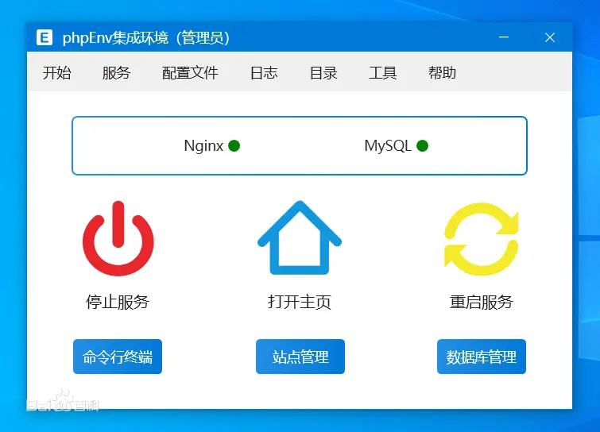
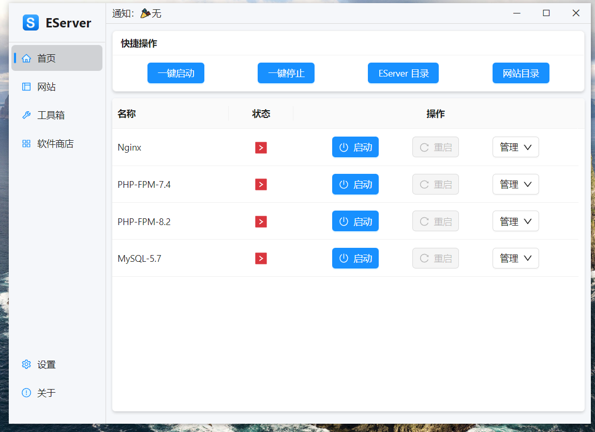
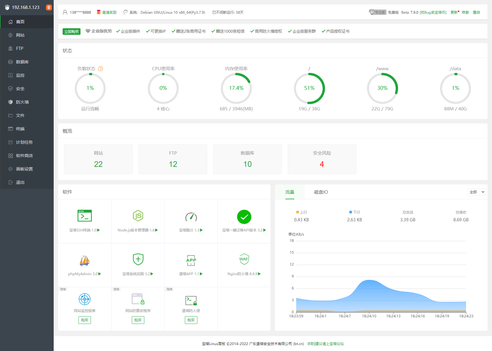
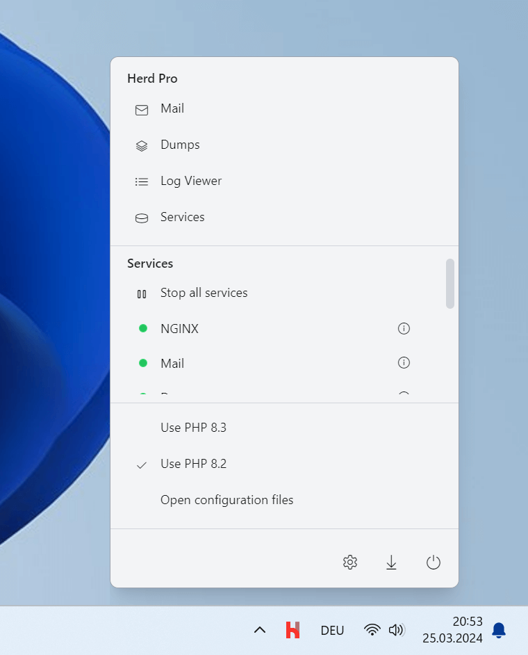
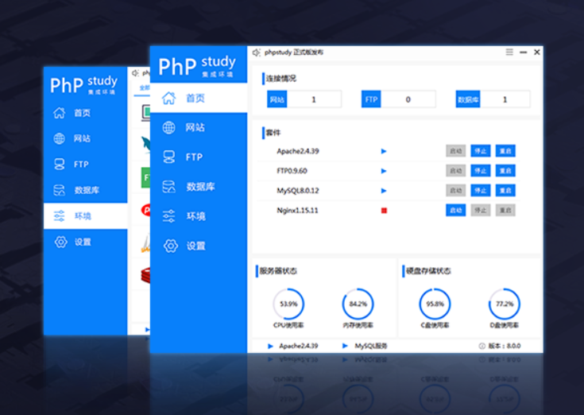
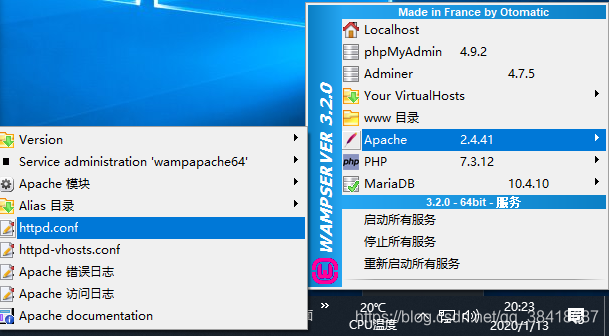
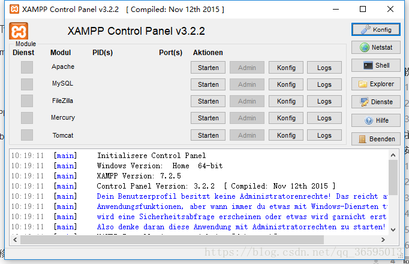
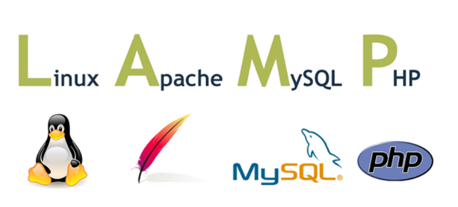

## 前言

XinAdmin 框架后台是基于 PHP 语言开发，在使用过程中难免离不开 PHP 开发环境的搭建，目前网络中的对 PHP 集成环境已经非常成熟了，本章中，我们通过介绍几款常用的集成开发环境，让开发者更好的使用 XinAdmin

:::info
XinAdmin 开发环境使用 Windows + EServer，安装 Nginx、Mysql 8.0、PHP8.2、Composer、phpMyAdmin，用 Windows 的小伙伴也建议使用这些，避免环境带来的影响。生产环境中，建议使用稳定性更强的宝塔面板。
:::

## 1、phpenv

<ImagePreview float>
  
</ImagePreview>

- 介绍：phpEnv 是 Windows 系统上一款专业优雅强大的集成开发环境
- 官方网站：[https://www.phpenv.cn/](https://www.phpenv.cn/)。
- 支持平台：windows。
- 简洁优雅的界面，界面颜值超高，简洁优雅，无论新手还是老手都能愉快地学习使用。
- 多款 web 服务器，支持 Apache、Nginx，功能强大的站点管理，可视化配置 https 等。
- 多版本 php,mysql，软件商店想下什么版本就有什么版本，支持不同 php 版本共存。
- 强大的常用工具，内置功能强大的命令行、tcp 进程列表、mysql 改密等工具。

## 2、EServer

<ImagePreview float>
  
</ImagePreview>

- 介绍：phpenv 官方推出的一款跨平台集成开发环境，支持安装扩展，集成 PHP7.4、Nginx、MySQL5.7 等，可通过“软件商店”下载其他版本。
- 官方网站：[https://www.phpenv.cn/](https://www.phpenv.cn/)
- 支持平台：windows、mac

## 3、宝塔面板

<ImagePreview float>
  
</ImagePreview>

- 介绍：宝塔面板是提升运维效率的服务器管理软件，支持一键 LAMP/LNMP/集群/监控/网站/FTP/数据库/JAVA 等 100 多项服务器管理功能。
- 官方网站： [https://www.bt.cn/](https://www.bt.cn/)
- 支持平台：windows、linux。
- 网站管理： 通过宝塔面板创建管理网站，轻松简单完成各种配置
- 数据库管理： 一键创建数据库，一键设置备份还原
- 资源监控： CPU、内存、磁盘 IO、网络 IO 数据监测，可设置记录保存天数，以及任意查看某天数据
- 文件管理： 方便高效的文件管理器，支持上传、下载、打包、解压以及文件编辑查看
- 软件商店： 通过 web 界面就可以轻松管理安装所用的服务器软件，还有扩展插件
- 生产可用： 宝塔面板是一款专业的运维系统，稳定性高，可用于生产环境

## 4、laravel herd

<ImagePreview float>
  
</ImagePreview>

- 介绍：Herd 是适用于 macOS 和 Windows 的快速原生 Laravel 和 PHP 开发环境。它包括开始 Laravel 开发所需的一切，包括 PHP 和 nginx
- 官方网站： [https://herd.laravel.com/](https://herd.laravel.com/)
- 支持平台：windows、macOS。
- 最快的环境： Herd 对 PHP、nginx 和 dnsmasq 使用静态二进制文件，使其更快 比其他 PHP 开发环境。
- 入门所需的一切： Herd 包括 Composer、Laravel 安装程序和 Expose 的二进制文件，使其可用 自动添加到您的 CLI 中。
- Herd 附带了 nvm（Node 版本管理器），让您可以轻松管理计算机上的 Node.js 版本。
- Herd 附带 PHP 7.4 - 8.3，您可以在几秒钟内在这些版本之间切换。Herd 甚至允许您将站点固定到特定的 PHP 版本。

## 5、PhpStudy

<ImagePreview float>
  
</ImagePreview>

- 介绍：PHPStudy（小皮）V8.1，全面重构，全新 UI，让天下没有难配的服务器环境十二年公益，初心不改
- 官方网站：[https://xp.cn/](https://xp.cn/)
- 支持 CentOS、Ubuntu、Debian、Fedora、deepin，Web 端管理，QQ 群及论坛技术支持一键创建网站、FTP、数据库、SSL；安全管理，计划任务，文件管理，PHP 多版本共存及切换；自带 LNMP 与 LAMP
- 支持 Web 端管理，一键创建网站、FTP、数据库、SSL；安全管理，计划任务，文件管理，PHP 多版本共存及切换；自带 LNMP 与 LAMP

## 6、wampserver

<ImagePreview float>
  
</ImagePreview>

- WampServer 是一款由法国人开发的 Apache Web 服务器、PHP 解释器以及 MySQL 数据库的整合软件包。简单的说 WampServer 就是 Windows Apache Mysql PHP 集成安装环境，即在 window 下的 apache、php 和 mysql 的服务器软件免去了开发人员将时间花费在繁琐的配置环境过程，从而腾出更多精力去做开发。
- 官方网站：[https://www.wampserver.com/en/](https://www.wampserver.com/en/)
- 中文网：[https://wampserver.site](https://wampserver.site/Index/index.html)

## 7、XAMPP

<ImagePreview float>
  
</ImagePreview>

- XAMPP 是完全免费且易于安装的 Apache 发行版，其中包含 MariaDB、PHP 和 Perl。XAMPP 开放源码包的设置让安装和使用出奇容易。
- 支持 Windows、Linux、Solaris、Mac OS X 等多种操作系统下安装使用，支持多语言：英文、简体中文、繁体中文、韩文、俄文、日文等。
- 官方网站：[https://www.apachefriends.org/](https://www.apachefriends.org/)

## 8、LNMP 一键安装包

<ImagePreview float>
  
</ImagePreview>

- LNMP 一键安装包是一个用 Linux Shell 编写的，可以为 CentOS/Debian/Ubuntu/Deepin 或独立主机安装 LNMP(Nginx/MySQL/PHP)、LNMPA(Nginx/MySQL/PHP/Apache)、LAMP(Apache/MySQL/PHP)生产环境的 Shell 程序。
- 官方网站：[https://www.lnmp.org/](https://www.lnmp.org)
